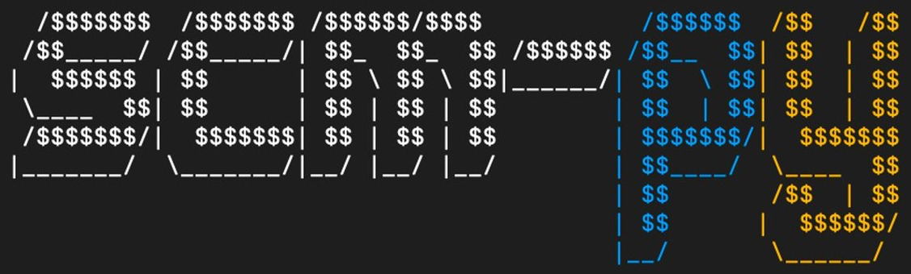
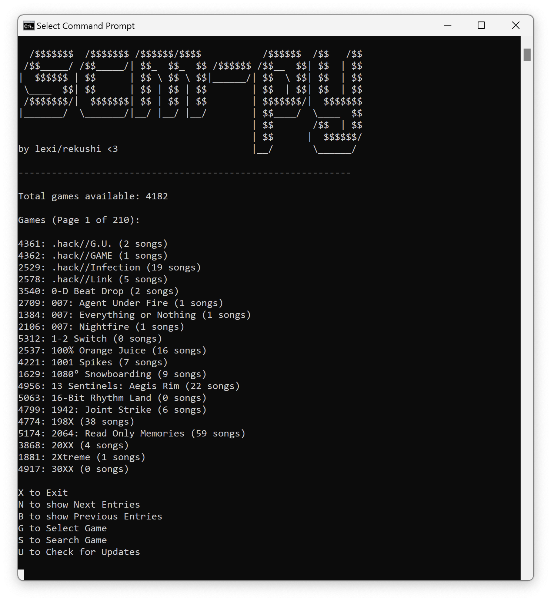

<div align="center">
  <a href="https://github.com/RekuNote/scm-py/">
    
  </a>

  <h3 align="center">scm-py</h3>

  <p align="center">
    scm-py is a python port of <a href="https://www.github.com/RekuNote/scm-cli">scm-cli</a> for downloading BRSTM files from Smash Custom Music Archive (smashcustommusic.net)
    <br />
    © RekuBuild 2024
    <br />
    <br />
  </p>
</div>

## Table of Contents

- [Features](#features)
- [Screenshots](#screenshots)
- [Requirements](#requirements)
- [Usage](#usage)
- [License](#license)

## Features

- Supports Windows, Linux, and macOS.
- List all available games and their corresponding IDs.
- Search for games by name.
- Search for songs by game ID.
- Download BRSTM (or other) files by song ID.
- Specify output path for downloads.

## Screenshots



## Requirements

- `requests`, `PIL`, and `tqdm` Python modules are required. (When ran, scm-py will automatically check for these modules and prompt to install if not found.)

To install these modules manually, run:
```sh
pip3 install requests, pillow, tqdm
```
or
```sh
pip install requests, pillow, tqdm
```


## Usage

Download and run scm-py:

```sh
python scm-py.py
```

## License

This project is licensed under a modified version of the MIT License.
